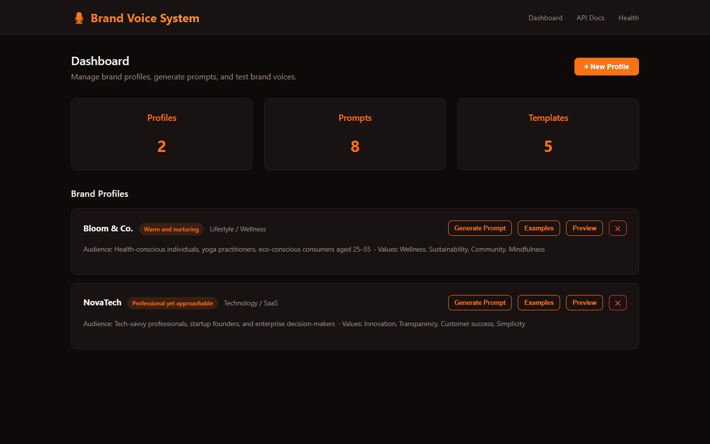
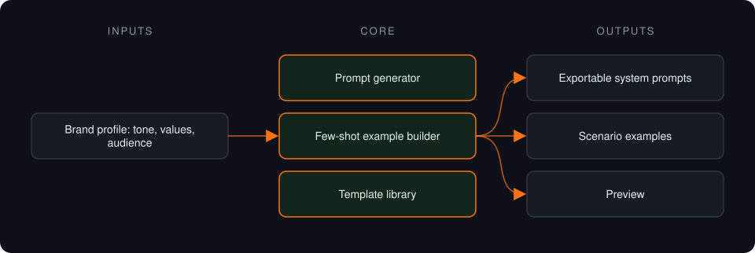

# Brand Voice System

**Framework that turns brand tone guidelines into structured system prompts and few-shot examples for any AI chatbot.**

> **This is a proprietary project. Source code is private. This page showcases the system's architecture and results.**

**Case study page:** [https://jryahia.github.io/showcase-brand-voice-system/](https://jryahia.github.io/showcase-brand-voice-system/)

## Problem it solves

Every chatbot a brand deploys drifts to its own tone. This system stores a brand profile once and generates consistent prompts and examples for OpenAI, Anthropic or generic models.

## Architecture

1. A brand profile is defined once.
2. Structured system prompts are generated from it.
3. Scenario-specific few-shot examples are generated alongside.
4. Prompts are previewed and exported for the target model.

## Key features

- Multiple brand profiles
- Prompt generation per target model
- Few-shot examples per scenario
- Prompt preview
- Export in ready-to-use formats

## Tech stack

     

## What it does in practice

- Gives every bot a brand deploys the same voice from a single source of truth.

## Screenshots

**Brand profiles and generated prompts**

---

Built by [Yahya Jarray](https://github.com/jryahia). Interested in a similar system? [Get in touch](mailto:yahiajarray43@gmail.com).
